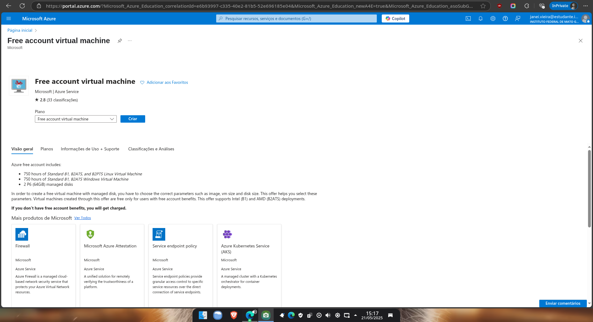
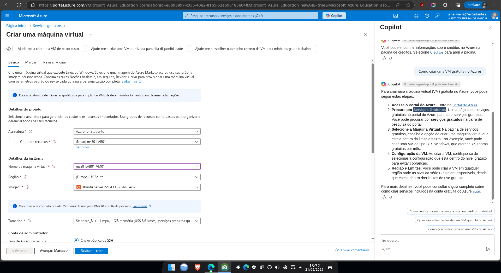
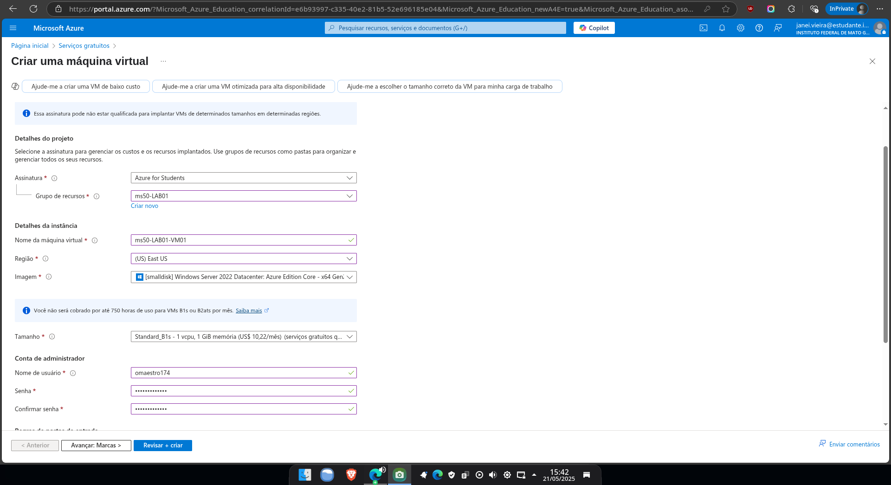
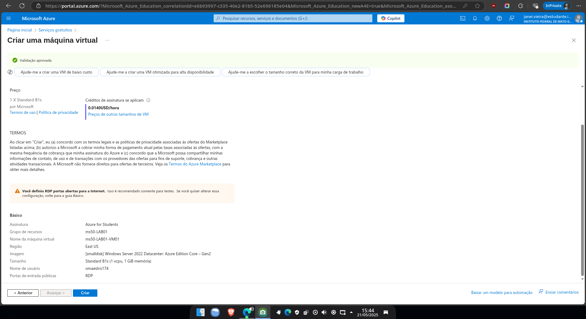
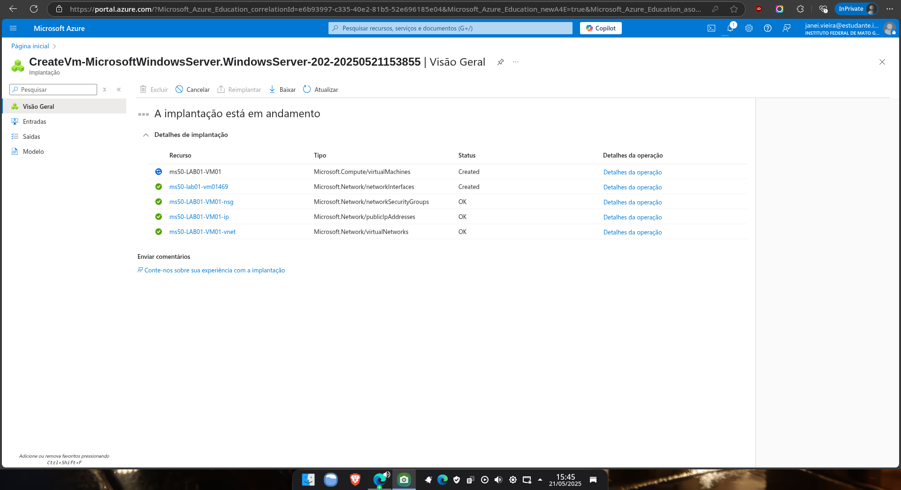
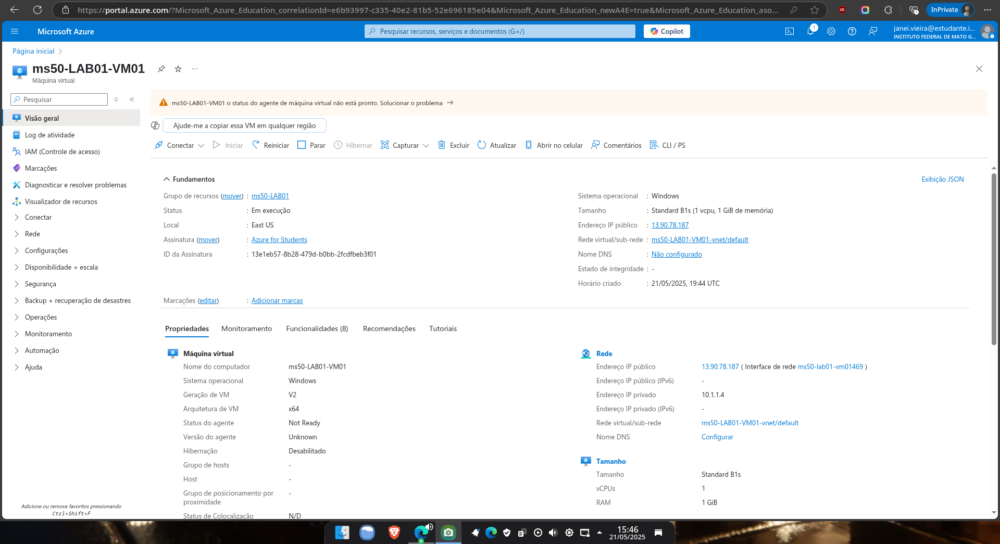
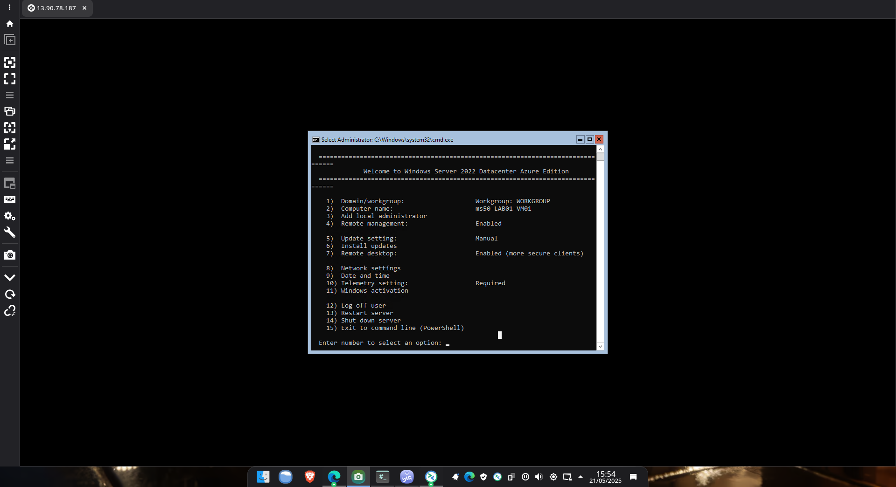

# 💻 Criando uma Máquina Virtual Windows no Azure: Minha Experiência

Ao criar uma máquina virtual com Windows no Azure para um labaratório da DIO no curso Microsoft 50 Anos - Computação em Nuvem com Azure, fiz algumas reflexões rápidas sobre o que observei e aprendi.

---

## 🟦 Etapa 1 – Acesso ao Portal e Início da Criação

Logo que entrei no [portal do Azure](https://portal.azure.com), fui direto até a seção de **Máquinas Virtuais**. No canto superior, escolhi a opção **"Criar > Máquina virtual"**.

---

## 📦 Etapa 2 – Criando o Grupo de Recursos

Optei por criar um novo grupo de recursos, para manter essa máquina virtual e seus componentes organizados. Dei um nome intuitivo ao grupo e segui em frente.

---

## 🧱 Etapa 3 – Configurando a Máquina Virtual

Escolhi a imagem do **Windows Server 2022**, defini o nome da VM, região, tamanho da máquina e credenciais de acesso. Tudo de forma bastante guiada.

---

## 🔍 Etapa 4 – Revisão das Configurações

Antes de finalizar, o portal apresenta um resumo com todos os parâmetros configurados. Aproveitei para revisar cada detalhe, especialmente o tipo de disco e a regra de firewall que permite RDP.

---

## ⚙️ Etapa 5 – Provisionamento

Cliquei em "Criar" e o Azure iniciou o processo de provisionamento da máquina. Acompanhei o andamento pelo portal.

---

## ✅ Etapa 6 – Conclusão da Criação

Com a máquina pronta, o portal mostrou um painel com todas as informações de acesso e status do recurso.

---

## 🔐 Etapa 7 – Conexão via RDP

Utilizei a opção de **conectar por RDP** diretamente pelo portal. Baixei o arquivo `.rdp`, abri no meu computador e conectei usando as credenciais configuradas anteriormente.

---

## ✍️ Conclusão

Essa experiência de criar uma VM Windows no Azure foi tranquila e muito bem assistida pela interface da plataforma. A documentação visual do processo me ajudou bastante a registrar cada detalhe. Mais do que um tutorial, foi uma prática que reforçou minha familiaridade com o ecossistema da Azure.

Se eu fosse repetir, certamente aproveitaria templates ou automatizaria via ARM ou Terraform – mas isso é papo pra outro experimento.
